## Praktikum 3 :PHP dan database MYSQL
Nama : Laela Nur Rohmah
Nim : 312110425
Kelas : TI.21.A3

## 1. Start MYSQL Sever
untuk menjalankan MySQL Server dari menu XAMPP Control

## 2. Membuat Database
Create Database dengan nama latihan1;

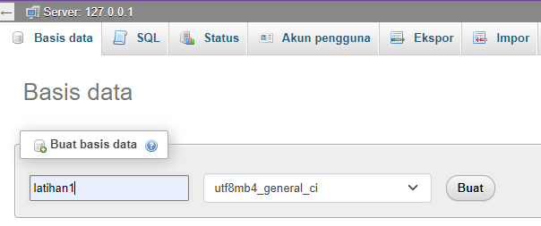

## 3. Membuat Tabel
code :

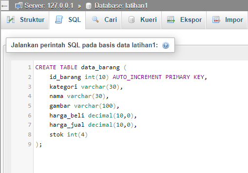

## 4. Membuat Program CRUD
buat folder lab3_php_database pada root directory web server (C:\xampp\htdocs)

output :

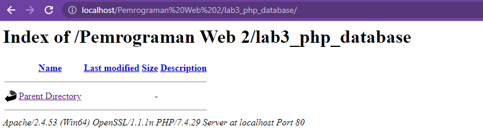

## 5. Membuat file koneksi database
buat file baru dengan nama koneksi.php

code :
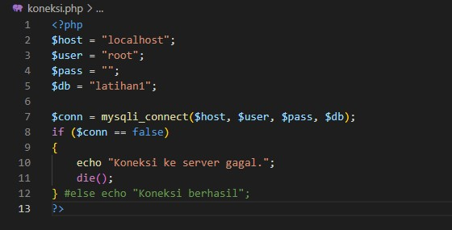

output :

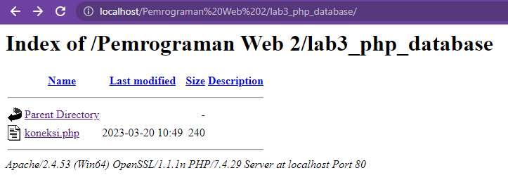

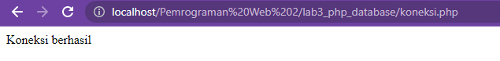

## 6. Membuat file index untuk menampilkan data (Read)
buat file baru dengan nama index.php

code :

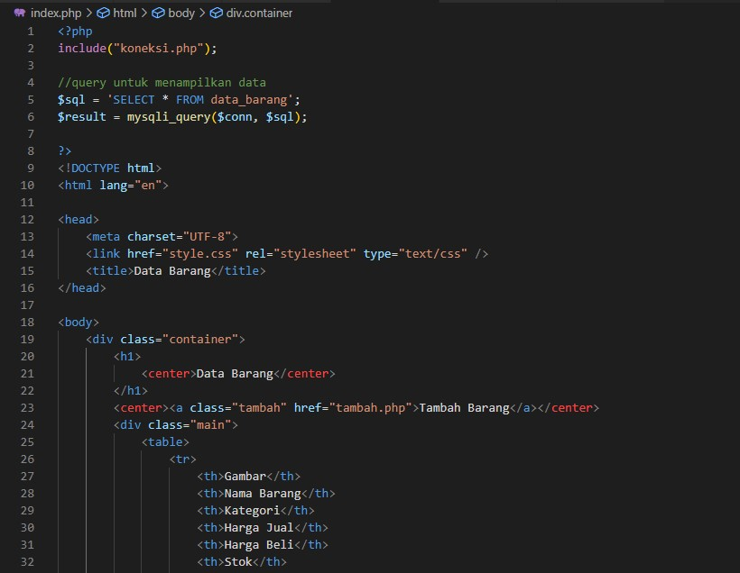

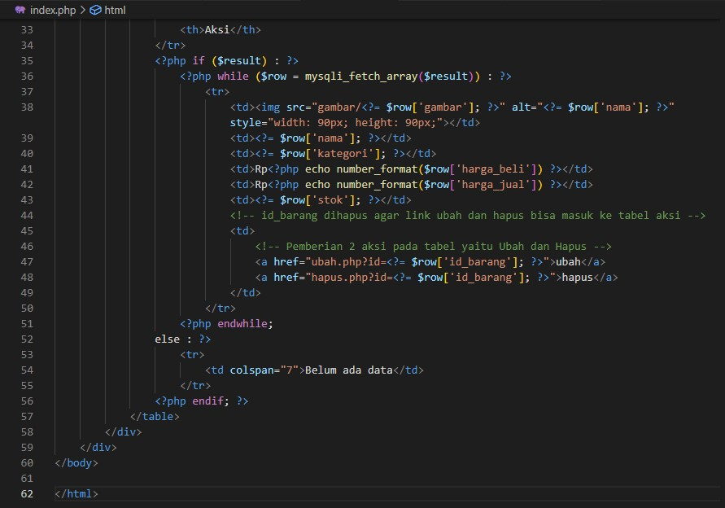

outpput :

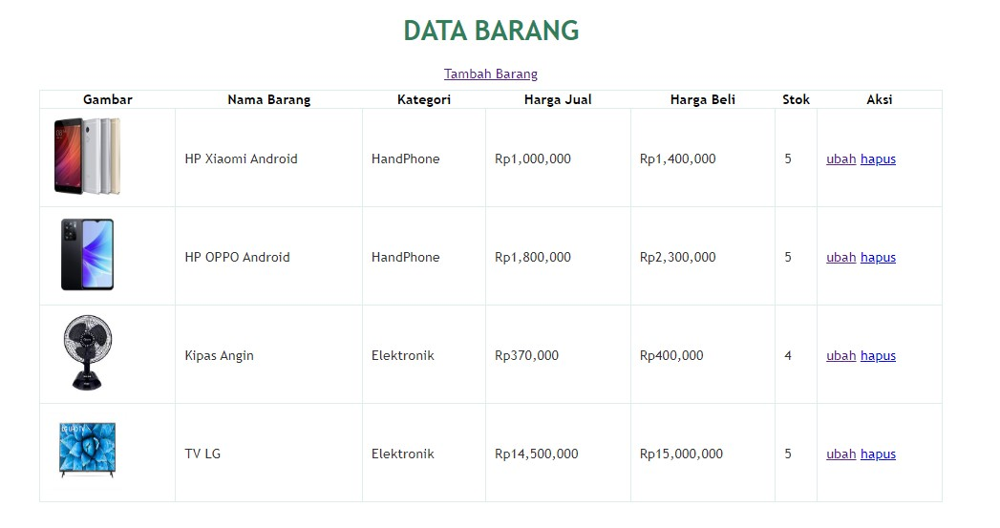

## 7. Menambah Data (Create)
Buat file baru dengan nama tambah.php

code :

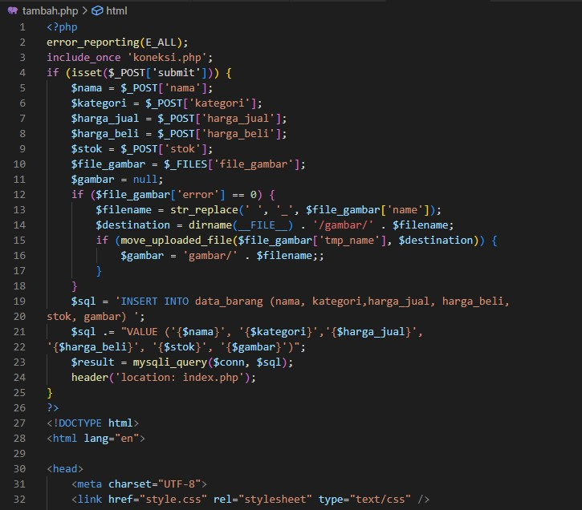

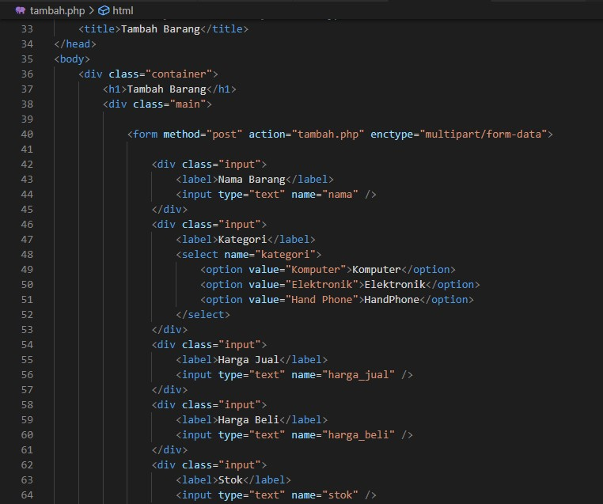

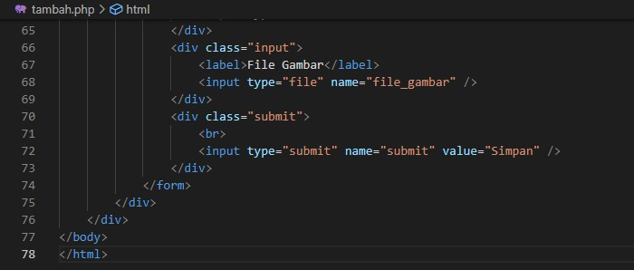

output :

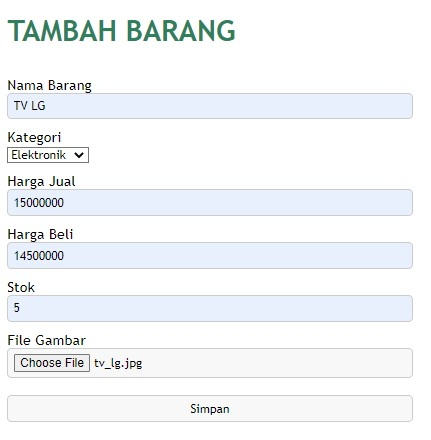

## 8. Mengubah Data (Update)
Buat file baru dengan nama ubah.php

code :

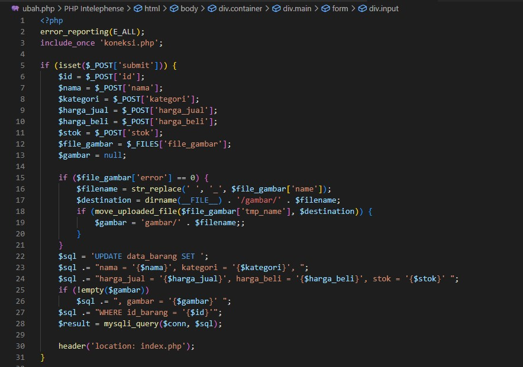

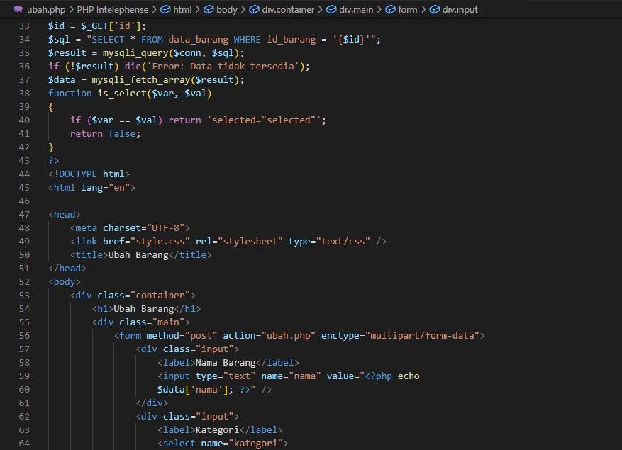

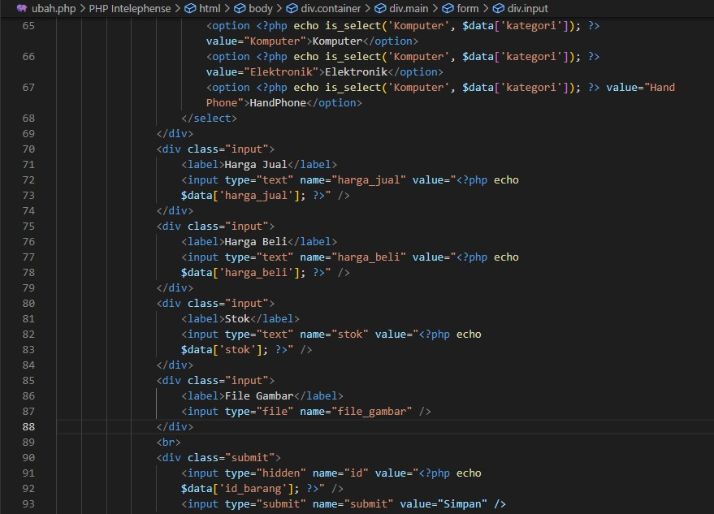

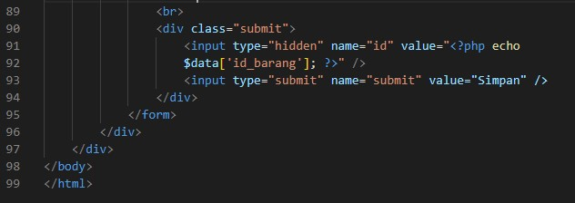

output :

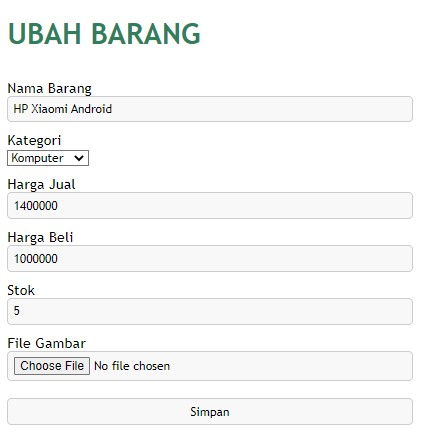

## 9. Menghapus data (Delete)
buat file baru dengan nama hapus.php

code :

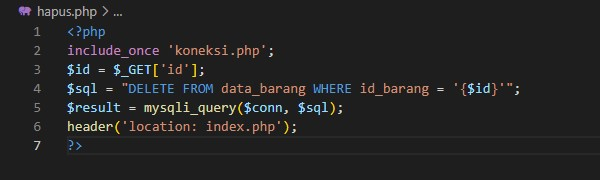